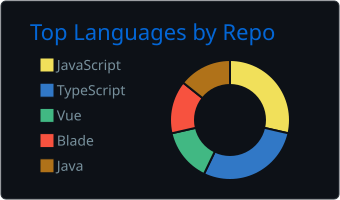
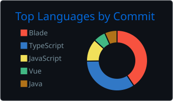
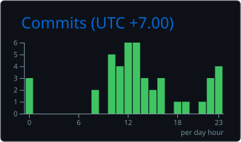

# Bành Nhật Khang

### Fresher Java Developer | Spring Boot & React

**Information Technology — Can Tho University**

Currently seeking opportunities in  
**Java Backend Development** and **Full-Stack Web Development**

  <a href="mailto:banhnhatkhang2702@gmail.com">Email</a>
  •
  <a href="https://www.linkedin.com/in/banhnhatkhang/">LinkedIn</a>
  •
  <a href="https://github.com/BanhNhatKhang">GitHub</a>

---

## About Me

I am an Information Technology graduate from Can Tho University with
experience building full-stack web applications.

My primary focus is backend development with **Java 17**, **Spring Boot**,
**REST APIs**, and relational databases. I also work with **React**,
**TypeScript**, and real-time web technologies.

- Currently developing a Social Watching platform with Spring Boot and React.
- Interested in backend architecture, API design, authentication, and real-time systems.
- Learning Docker, AWS, Redis, software testing, and AI model integration.
- Self-studying Japanese for opportunities in Japanese software projects.

---

## Core Technical Skills

| Area | Technologies |
|---|---|
| Backend | Java 17, Spring Boot, Spring Security, REST API, Maven |
| Frontend | React, TypeScript, JavaScript, HTML, CSS, Vite |
| Database | PostgreSQL, MySQL, MongoDB, SQL Server |
| Real-time | WebSocket, STOMP, WebRTC |
| Storage | Cloudflare R2, S3-compatible object storage |
| Tools | Git, GitHub, Docker, Postman, VS Code |
| Currently learning | AWS, Redis, AI model integration, Japanese |

---

## Featured Projects

### Vifi — Social Watching Platform

A full-stack social entertainment platform that allows users to discover
movies, interact with other users, and watch content together in real time.

**My responsibilities**

- Designed and implemented backend and frontend modules.
- Built REST APIs and integrated them with React and TypeScript.
- Developed real-time Watch Room functionality using WebSocket and WebRTC.
- Implemented authentication, user profiles, comments, ratings, and notifications.
- Integrated Cloudflare R2 for S3-compatible media storage.
- Developed an AI-assisted video moderation workflow operating in Shadow Mode.
- Worked with a modular Spring Boot architecture and a multi-module Maven project.
- Implemented administrative modules for content and system management.

**Main technologies**

`Java 17` · `Spring Boot` · `Spring Security` · `React` · `TypeScript`  
`PostgreSQL` · `WebSocket` · `WebRTC` · `Docker` · `Cloudflare R2`

> The production source code is currently private. Architecture documentation,
> selected screenshots, and technical explanations can be provided for review.

---

### Library Management System

A full-stack library management application with a Java backend and
a React frontend.

**Highlights**

- Developed a REST API using Java 17 and Spring Boot.
- Built the frontend with React and TypeScript.
- Used PostgreSQL for relational data storage.
- Used Docker to provide the PostgreSQL development environment.
- Implemented user and administrative workflows.

**Main technologies**

`Java 17` · `Spring Boot` · `React` · `TypeScript` · `PostgreSQL` · `Docker`

[View repository](https://github.com/BanhNhatKhang/library_management_system)

---

### Book Borrowing Service

A web application for managing books, readers, staff, and borrowing operations.

**Highlights**

- Built the backend with Node.js and Express.
- Used MongoDB and Mongoose for data persistence.
- Developed the frontend with Vue 3.
- Implemented authentication and password hashing.
- Implemented book, reader, employee, and borrowing management.

**Main technologies**

`Node.js` · `Express` · `MongoDB` · `Mongoose` · `Vue 3`

[View repository](https://github.com/BanhNhatKhang/book_borrowing_service)

---

### Movie Booking System

A web application for browsing and managing cinema content.

**Highlights**

- Developed a custom PHP MVC architecture.
- Used Blade as the template engine.
- Used PostgreSQL for data persistence.
- Implemented user authentication.
- Integrated Google OAuth.
- Developed user-facing and administrative functionality.

**Main technologies**

`PHP` · `MVC` · `Blade` · `PostgreSQL` · `Google OAuth`

[View repository](https://github.com/BanhNhatKhang/movie-booking-system)

---

## GitHub Summary

 

---

## 🐍 Contribution Activity

---

## Contact

- **Email:** [banhnhatkhang2702@gmail.com](mailto:banhnhatkhang2702@gmail.com)
- **LinkedIn:** [Bành Nhật Khang](https://www.linkedin.com/in/banhnhatkhang/)
- **GitHub:** [BanhNhatKhang](https://github.com/BanhNhatKhang)

### Open to Fresher Java Developer and Backend Developer opportunities

